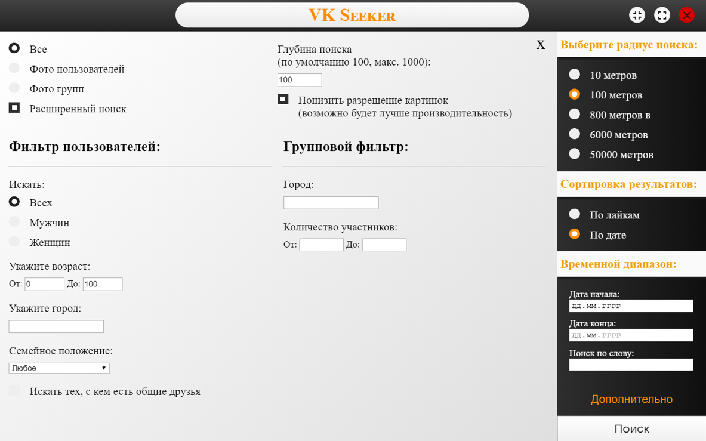
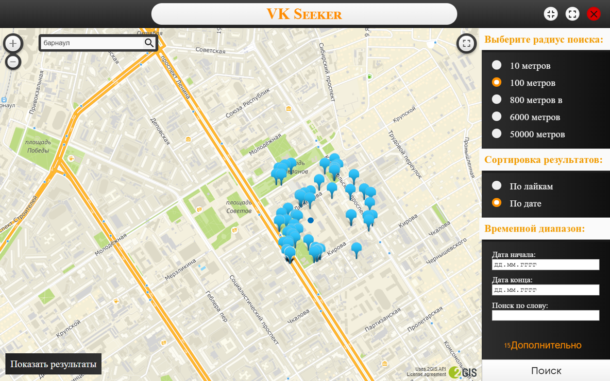
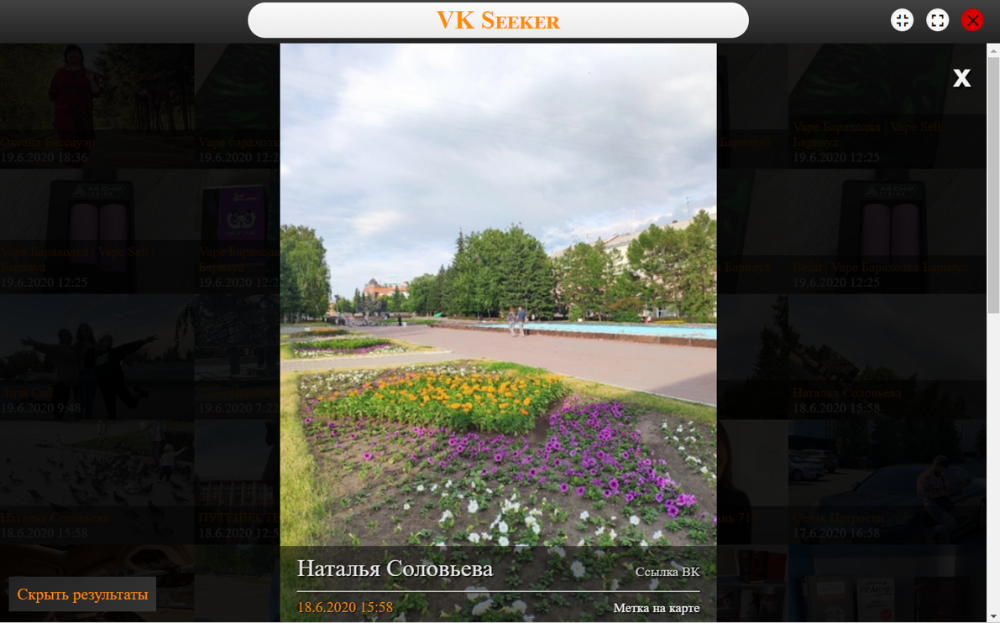

# VK seeker
It is desktop application which allows you to find VK ptotos on 2gis map by geolocation.  
This app was created by Electron framework

## Download:
[Download App](https://yadi.sk/d/aFpVBYgJiZs-LQ)

## Screenshots:

